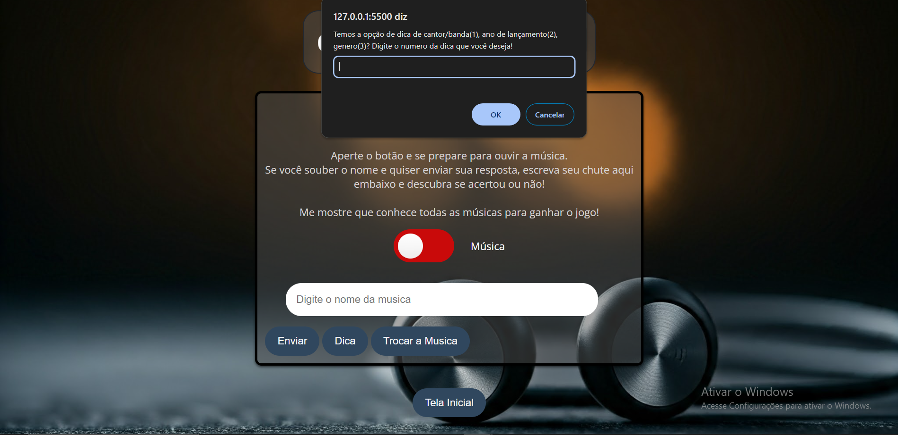

# Guess the song!

Este projeto apresenta um teste em formato de jogo onde o usuário precisa adivinhar o nome de uma música com base na melodia.

# Fotos

## Tecnologias Utilizadas

* **HTML:** Estrutura da página.
* **CSS:** Estilização da página.
* **JavaScript:** Lógica do jogo.

## Como Executar

1. Clone este repositório: `git clone https://github.com/seu-usuario/seu-repositorio.git`
2. Abra o arquivo `index.html` em seu navegador.

3. Ou use o deploy com este link: [guess-the-song-five.vercel.app](https://guess-the-song-five.vercel.app/)

## Estrutura de Arquivos

* **index.html:** Página principal do jogo.
* **style.css:** Arquivo de estilos CSS.
* **script.js:** Arquivo JavaScript com a lógica do jogo.

## Funcionalidades

* **Tela inicial:** Apresenta as regras do jogo.
* **Tela de jogo:** Permite ao usuário inserir o palpite e verifica a resposta.
* **Botões de navegação:** Permitem alternar entre as telas.

