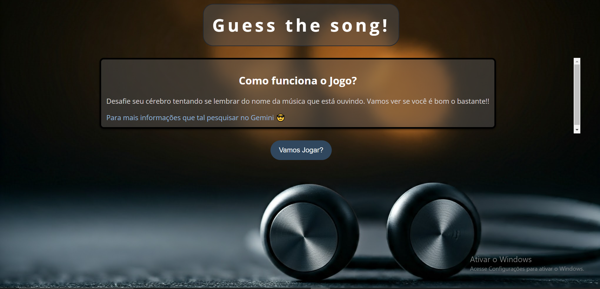
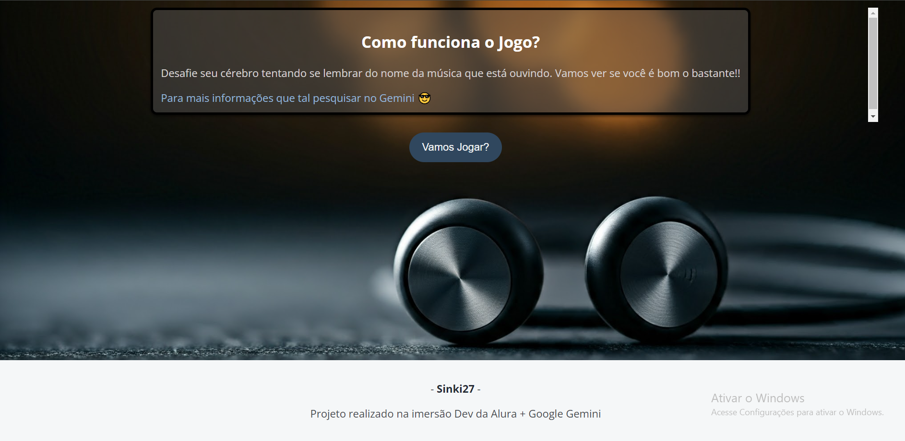
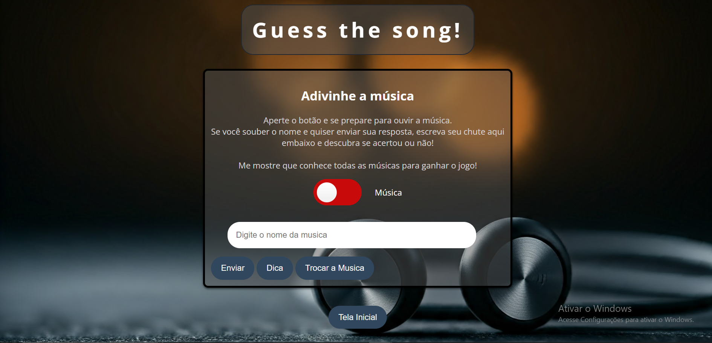

# Guess the song!

## Descrição
Este projeto foi desenvolvido durante a <strong>Imersão Dev da Alura</strong> onde foi livre a escolha do tema. Nele é apresentado um teste em formato de jogo onde o usuário precisa adivinhar o nome de uma música com base na melodia.

# Fotos

# Funcionalidades

* **Tela inicial:** Apresenta as regras do jogo.
* **Tela de jogo:** Permite ao usuário inserir o palpite e verifica a resposta.
* **Botões de navegação:** Permitem alternar entre as telas.
  
# Tecnologias Utilizadas

* **HTML:** Estrutura da página.
* **CSS:** Estilização da página.
* **JavaScript:** Lógica do jogo.

# Como Executar

1. Clone este repositório: `git clone https://github.com/seu-usuario/seu-repositorio.git`
2. Abra o arquivo `index.html` em seu navegador.
   
## Via Vercel

3. Ou use o deploy com este link:
[guess-the-song-five.vercel.app](https://guess-the-song-five.vercel.app/)

## Gostaria de contribuir?

Você tem ideias para fazer o projeto evoluir? Se sinta a vontade para sugerir ideias e novas funcionalidades! Pode me mandar pelas minhas redes, todas elas estão no meu perfil aqui mesmo do github, se não você pode abrir uma issue ou mandar uma pull request no repositório. Qualquer ajuda será bem-vinda agradeço!!!
